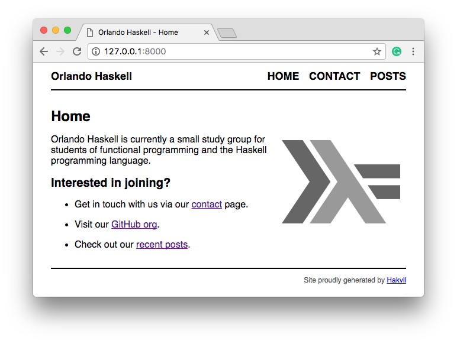

# Orlando Haskell Static Site



## Prerequisites

- Haskell Platform
- Hakyll

```sh
$ brew cask install haskell-platform
$ stack setup
$ stack install hakyll
```

## Setup

```sh
$ stack init
$ stack build
$ stack exec site build
```

## Posts

Want to create a post with Markdown?

Copy an example file in the `posts` folder and adjust the filename and existing
content with your new content!

## Publish Site

```sh
$ git checkout gh-pages
$ stack exec site clean
$ stack exec site build
$ cp -r _site/* ../../
$ git commit -am "Update gh-pages"
$ git push origin gh-pages
```

